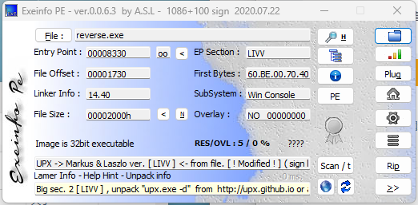

# 附加题

!!! note "相关资料"
    [CSDN-UPX魔改壳](https://blog.csdn.net/liKeQing1027520/article/details/142188160?spm=1001.2101.3001.6650.6&utm_medium=distribute.pc_relevant.none-task-blog-2%7Edefault%7EBlogCommendFromBaidu%7ERate-6-142188160-blog-144810681.235%5Ev43%5Epc_blog_bottom_relevance_base3&depth_1-utm_source=distribute.pc_relevant.none-task-blog-2%7Edefault%7EBlogCommendFromBaidu%7ERate-6-142188160-blog-144810681.235%5Ev43%5Epc_blog_bottom_relevance_base3&utm_relevant_index=8) 
    [x32dbg去壳](https://blog.csdn.net/weixin_46287316/article/details/109669066) 

## 去壳

先用查壳软件查看，发现加了UPX壳

从他的提示中可以看到`UPX -> Markus & Laszlo ver. [ LIVV ] <- from file. [ ! Modified ! ] ( sign like UPX packer )` 这个UPX壳是`!Modified`，被修改过，因此直接去壳无法实现，效果如下图所示。

接下来用010Editor发现UPX头被改了，如下图所示(更改前后对比)

### 去壳方法一

直接 `upx -d <路径>`

再去检查，发现为`.text`，即去壳成功

### 去壳方法二

在修改后，用x32dbg打开，根据esp定律去壳。

先运行，找到`pushad`,关注`esp`的值，然后单步运行，发现`esp`值发生改变

设置硬件断点，然后运行，之后会自动停下来， 往上可以看到一个popad的指令，该指令将寄存器的值进行还原。找到下面一个jmp指令所要跳转的位置，就是程序的OEP

然后使用插件`Scylla`去壳即可得到下面的文件

## 逆向

